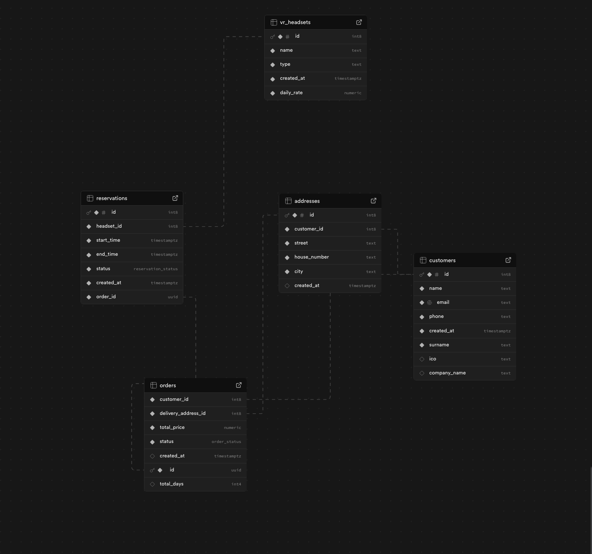

# Virtuio - VR Headset Rental Platform

Aplikace pro půjčování VR headsetů postavená na moderním tech stacku s Next.js, Supabase a Stripe.

## 🚀 Technologie

### Backend & Database

- **Supabase** - PostgreSQL databáze a autentizace
- **Stripe** - Platební brána pro zpracování plateb

### Frontend

- **Next.js 15** - React framework s App Routerem
- **TypeScript** - Type-safe development
- **Tailwind CSS** - Styling

## 📊 Databázové schéma

Projekt využívá následující databázové struktury:



### Hlavní tabulky:

- **customers** - Zákazníci a kontaktní údaje
- **vr_headsets** - Katalog VR headsetů k pronájmu
- **reservations** - Rezervace headsetů s časovými údaji
- **orders** - Objednávky a platební informace
- **addresses** - Dodací adresy zákazníků

## 💳 Platební proces

Aplikace využívá **Stripe** pro zpracování plateb. Po úspěšné platbě:

1. Stripe odešle webhook na náš endpoint
2. Webhook potvrdí objednávku
3. Status objednávky se změní z `pending` na `paid`
4. Zákazník obdrží potvrzovací email

### Stripe Webhook

Webhook endpoint zpracovává událost `checkout.session.completed` a automaticky aktualizuje status objednávky v databázi.

```typescript
// Příklad zpracování webhooku
stripe.webhooks.constructEvent(...)
// -> Ověření podpisu
// -> Aktualizace order.status na 'paid'
// -> Odeslání potvrzovacího emailu
```

## 🛠️ Instalace

```bash
# Instalace závislostí
pnpm install

# Spuštění dev serveru
pnpm dev
```

Aplikace běží na [http://localhost:3000](http://localhost:3000)

## 🔧 Nastavení prostředí

Vytvoř soubor `.env.local` s následujícími proměnnými:

```env
# Supabase
NEXT_PUBLIC_SUPABASE_URL=your_supabase_url
NEXT_PUBLIC_SUPABASE_ANON_KEY=your_supabase_anon_key

# Stripe
NEXT_PUBLIC_STRIPE_PUBLISHABLE_KEY=your_stripe_pk
STRIPE_SECRET_KEY=your_stripe_sk
STRIPE_WEBHOOK_SECRET=your_webhook_secret
```

## 📝 Licence

© 2026 Virtuio
